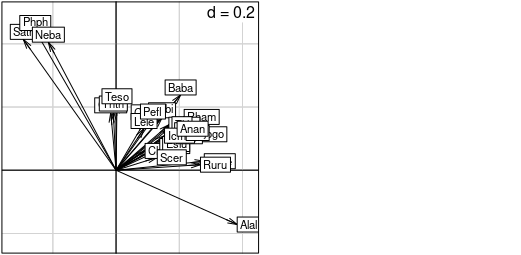

```{r setup, include = FALSE}
options(htmltools.dir.version = FALSE)
```

```{r packages, include = FALSE}

# Load necessary packages for generation of R code in the presentation

## Only needed to run for the set-up

#devtools::install_github("gadenbuie/xaringanExtra")

library(ade4)
library(adegraphics)
library(tidyverse)
library(xaringan)
library(xaringanthemer)
library(xaringanExtra)
library(showtext)

```

```{r xaringanExtra, include = FALSE}

xaringanExtra::use_tachyons()
xaringanExtra::use_tile_view()
xaringanExtra::use_editable(expires = 1)
xaringanExtra::use_panelset()
xaringanExtra::use_animate_css()
xaringanExtra::use_extra_styles(hover_code_line = TRUE)

```


```{r xaringan-themer, include=FALSE}

# sélection du thème de couleurs du slideshow
style_duo(primary_color = "#1F4257", secondary_color = "#F97B64")

```

class: center, middle 

# Plan de la présentation 

1) La co-inertie c'est quoi?

2) Un exemple : données simulées

3) Pour aller plus loin...

---
class: top

# 1) La co-inertie c'est quoi?

## Cadre général 

- On a 2 tableaux : même individus et différentes variables 

--

- On regarde les structures communes entre les 2 tableaux (et donc les variables qui les composent)

--

- 1 seule contrainte pour les 2 tableaux : les individus doivent être identiques (attention aux noms dans les tableaux!) et avec la même pondération.

--

Cadre typique : un tableau avec plutôt des variables réponses (matrice Y) et le deuxième avec plutôt des variables explicatives (matrice X). <br>

--

Notre exemple : des stations de mesures avec dans un premier tableau des variables d'abondances d'espèces (Y) et dans le deuxième tableau des variables environnementales(X) ). <br>
Obectif : regarder les relations entre les abondances et l'environnement

---

# 1) La co-inertie c'est quoi?

## Contraintes

- La pondération entre les individus dépendent des analyses ( a relire/reformuler)

--

- Les individus doivent être identiques (attention au naming!) 

--

- Les individus doivent avoir la même pondération entre les deux tableaux, i.e que les poids attribués à la première analyse factorielle doivent être identiques aux poids de la seconde analyse factorielle 


---

# 1) La co-inertie c'est quoi?

## La démarche 

- Il faut d'abord réaliser une analyse factorielle (ACP/AFC/ACM) pour chaque tableaux afin d'obtenir deux sous-espaces (ou nuage de points).

(figures/schema_coinertia1.png) # gerer la taille de l'image

--

- On "couple" ensuite ces 2 nuages de points par le critère de la maximisation de la covariance : 
$$\operatorname{cov}^{2}\left(X Q u_{1}, Y R v_{1}\right)=\operatorname{cor}^{2}\left(X Q u_{1}, Y R v_{1}\right) \operatorname{var}\left(X Q u_{1}\right) \operatorname{var}\left(Y R v_{1}\right)$$
--
  
- On obtient ainsi un seul sous-espace maximisant les relations entre les variables des 2 tableaux.

-- 

- Les relations entre les deux tableaux sont indiqué par le coefficient de corrélation RV s'exprimant : ECRIRE LA FORMULE MATHEMATIQUE 

---

# La démarche 

## Test de co-structure

On cherche à tester la significativité de la co-structure entre les 2 tableaux afin de déterminer si il y a bel et bien des relations entres les variables des deux tableaux d'origine.

Pour cela, on :

--

- Calcule la valeur de la co-inertie totale grâce aux coefficient RV entre les 2 tableaux

--

- Permute les lignes d'un des 2 tableaux et on recalcule le coefficient RV

--

- Itère ce processus autant de fois que l'on veux (au moins 1000 fois)

--

- On obtient ainsi une distribution empirique du coefficient RV selon le nombre de permutations et on peux ainsi déterminer la significativité de la co-structure, i.e si la co-structure entre les 2 tableaux était dû à l'aléa ou non.

---
class : center, middle

# Un exemple : données simulées 

```{r include=FALSE}

##### On construit le premier tableau

# C'est une simulation des abondances d'espèces dans plusieurs stations
# Ces stations sont au nombre de 16
# Elles sont réparties régulièrement le long d'un gradient de température
# On suppose que les abondances des espèces sont données par le modèle dit des températures cardinales
# Il y a en tout 10 espèces observées

# Fonction d'abondance des poissons
CTMI <- function(T, param)
{
  Tmin <- param[1]
  Topt <- param[2]
  Tmax <- param[3]
  Muopt <- param[4]
  if( T <= Tmin || T >= Tmax )
  # Si on est en dessous de la température min ou au dessus de la température max, le poisson est absent
  {
    return(0)
  }
  else
  # Si on est entre Tmin et Tmax
  {
      Num <- (T-Tmax)*(T-Tmin)^2
      Den <- (Topt-Tmin)*((Topt-Tmin)*(T-Topt)-(Topt-Tmax)*(Topt+Tmin-2*T))
      return(Muopt*Num/Den)
  }
}

# 16 stations, avec leurs températures moyennes
Tstations <- seq(from = 5, to = 80, by = 5)
Tstations
length(Tstations)

nsp <- 10 # Nombre d'espèces
topt <- seq(from = 5, to = 100, length = nsp) # Températures optimales, une par espèce
tmin <- 0.953*topt - 28.913 # Température minimale, une par espèce
tmax <- 1.101*topt + 3.203 # Température maximale, une par espèce

# On construit le tableau :
# 10 lignes correspondant aux 10 espèces, 16 colonnes correspndant aux 16 stations
data <- data.frame(matrix(nrow = nsp, ncol = length(Tstations)))
colnames(data) <- paste("st",1:length(Tstations), sep = "")
rownames(data) <- paste("sp", round(topt, 0), sep = "")

for( i in 1:nsp ){
  for( j in 1:length(Tstations))
  {
    # Pour chaque case de data, on simule la valeur à partir de la température de la station, de la
    # température optimale de l'espèce, de la température maximale, de la température minimale, de Muopt,
    # et de la fonction CTMI
    data[i, j] <- round(CTMI(T = Tstations[j], param = c(tmin[i], topt[i],tmax[i], 1000)), 0)
  }
}

# On va visualiser tout ça
Taxis <- 1:100
cols <- rev(rainbow(nsp, end = 5/6))
plot(x = Taxis, y = sapply(Taxis, CTMI, param = c(tmin[1], topt[1], tmax[1], 1000)), type = "l",
     col = cols[1], main = paste("Répartition des", nsp, "espèces"), xlab = "Température [C]",
     ylab = "Nombre d'individus", lwd = 2)
for( i in 2:nsp ){
  lines(x = Taxis, y = sapply(Taxis, CTMI, param = c(tmin[i], topt[i], tmax[i], 1000)),
        col = cols[i], lwd = 2)
}

```

```{r }

# La structure des données est très simple, on a une succession des espèces le long du gradient
table.value(data, clegend = 0)
# En abscisse les stations, en ordonnée les espèces

# Dans la vraie vie, on ne connait pas dès le début l'ordre des espèces et des stations qui mettent
# en évidence cette structure des données
# Elles ressembleraient plutôt à ça :
data.vv <- data[sample(nrow(data)), sample(ncol(data))] # On permute aléatoirement lignes et colonnes
table.value(data.vv, clegend = 0)

```

---

# Réalisation de l'AFC du premier tableau

```{r}

# On fait l'AFC (car données d'abondance) du tableau
afc <- dudi.coa(data.vv, scann = FALSE)
scatter(afc)
# On visualise bien l'effet Guttman (les données ont une forme de parabole)
# Cet effet témoigne de liaisons fortes

# Cela permet de ré-ordonner le tableau pour mettre en évidence le gradient
data.vv.ord <- data.vv[order(afc$li[, 1]), order(afc$co[, 1])]
table.value(data.vv.ord, clegend = 0)

```

---

# Réalisation de l'ACP du deuxième tableau

```{r}

##### On construit le deuxième tableau

# Mesure de la température dans chaque station, pour chaque heure de la journée
mesureT <- sapply(Tstations, function(x){10*sin(seq(0, pi, le = 24)) + x})
# Donc tableau avec 24 lignes et 16 colonnes
colnames(mesureT) <- paste("st",1:16,sep="")
rownames(mesureT)<-paste("h",1:24,sep="")
plot(0, type = "n", xlim = c(1,24), ylim = range(mesureT), xlab = "Heures", ylab = "Temperature",
     las = 1, main = "Température des stations") # Cadre vide
apply(mesureT, 2, lines) # 2 donc application en colonne, donc on affiche une courbe par station

# On ajoute un bruit Gaussien, pour plus de réalisme
set.seed(1)
mesureT <- sapply(Tstations, function(x){10*sin(seq(0, pi,le = 24)) + x + rnorm(n = 24, sd = 5)})
colnames(mesureT) <- paste("st", 1:16, sep = "")
rownames(mesureT) <- paste("h", 1:24, sep = "")
plot(0, type = "n", xlim = c(1,24), ylim = range(mesureT), xlab = "Heures",ylab = "Temperature",
     las = 1, main = "Température des stations") # Cadre vide
apply(mesureT, 2, lines)
# On a donc un gradient des stations froides aux stations chaudes
# Et une composante circadienne
# C'est difficile à voir vu l'intensité du bruit
table.value(mesureT, clegend = 0)

```

```{r}

# On fait l'ACP (car données quanti) du tableau
acp <- dudi.pca(t(mesureT), scan=FALSE) # t pour mettre les stations en ligne donc en tant qu'individus
scatter(acp)
# Le premier facteur représente la quasi-totalité de la variabilité, c'est simplement le gradient
# thermique entre les stations
plot(Tstations, acp$li[,1], ylab = "F1", xlab = "Température",
     main = "Le premier facteur de l'ACP est\nle gradient thermique", pch = 19)

```

---

# Réalisation de la co-inertie

```{r}

##### Couplage des deux tableaux

# On fait les vérifications nécessaires
# 1. Les individus communs aux deux tableaux sont-ils bien en ligne dans les deux tableaux ?
dim(data)
dim(mesureT)
tab1 <- as.data.frame(t(data))
tab2 <- as.data.frame(t(mesureT))
dim(tab1)
dim(tab2)
# 2. Les individus communs aux deux tableaux sont-ils bien dans le même ordre dans les deux tableaux ?
all.equal(rownames(tab1),rownames(tab2))
# 3. La même pondération a-t-elle bien été utilisée pour les deux analyses ?
coa <- dudi.coa(df = tab1, scannf = FALSE, nf = 2)
pca <- dudi.pca(df = tab2, row.w = coa$lw, scannf = FALSE, nf = 2)
all.equal(pca$lw,coa$lw)

# Tout est bon, on peut utiliser l'analyse de co-inertie pour coupler les deux tableaux
cia <- coinertia(dudiX = pca, dudiY = coa, scannf = FALSE, nf = 2)
cia$eig[1]/sum(cia$eig)
# Le premier facteur extrait 99.3% de la variabilité, c'est le gradient thermique (commun aux 2 tableaux)

```

---

# Test de la significativité

```{r}

# Significativité de la co-structure entre les deux tables ?
cia$RV
# On fait un test basé sur la comparaison entre la valeur de la co-inertie totale (coefficient RV entre
# les 2 tables) et la distribution empirique du coefficient RV qd on détruit la co-structure entre les 2
# tables en permutant les lignes de l'une
ciatest <- randtest(cia, nrepet =  999, fixed = 2)
plot(ciatest)
# Donc ici co-structure très significative entre les 2 tables, car RV est bien supérieur à ce qu'il
# devrait être si c'était une distribution aléatoire (= si pas de corrélation) !

```

---

# Graphiques et représentations 

```{r}

# Représentation graphique des trois tableaux analysés :
plot.new()
par(mfrow = c(2, 2))
# Données de température (tab2, ACP)
par(mfg = c(1, 2))
table.value(pca$tab, clabel.row = 0.7, clabel.col = 0.7)
# Données d'abondance (tab1, AFC)
par(mfg = c(2, 1))
table.value(t(coa$tab), clabel.row = 0.7, clabel.col = 0.7)
# Analyse de co-inertie
par(mfg = c(2, 2))
table.value(cia$tab, clabel.row = 0.7, clabel.col = 0.7)

```


---


On peux ainsi réaliser des graphiques pour l'interprétation 
.panelset[
.panel[.panel-name[R Code]

```{r fig.show='hide'}
# r code for the s.arrow plot 
```
]
.panel[.panel-name[sarrowplot1]

]
]

---

## .can-edit[You can edit this slide title]

<!-- .panelset[ -->
<!-- .panel[.panel-name[R Code] -->

<!-- ```{r panel-chunk, fig.show='hide'} -->
<!-- # ... r code ... -->
<!-- ``` -->
<!-- ] -->

<!-- .panel[.panel-name[Plot] -->

<!--  -->
<!-- ] -->
<!-- ] -->

---

# 3 - Pour aller plus loin...

On peux s'intéresser non pas à une analyse de co-inertie à 2 tableaux mais à K tableaux!<sup>1</sup>

.footnote[
[1] [Chessel, D. and M. Hanafi. “Analyses de la co-inertie de K nuages de points.” (1996).](http://www.numdam.org/article/RSA_1996__44_2_35_0.pdf)
]

---

# Bibliographie 

- Chessel D. and Hanafi M. “Analyses de la co-inertie de K nuages de points.” (1996)
[lien-1](http://www.numdam.org/article/RSA_1996__44_2_35_0.pdf)

- Lobry J.R. "Analyse de co-inertie sur données simulées et sur
données protéomiques." (2017) [lien-2](https://pbil.univ-lyon1.fr/R/pdf/tdr641.pdf)

- de Magny C. et al. "De la statistique élémentaire à l'analyse de co-inertie." (2006) [lien-3](https://www.researchgate.net/publication/282171950_De_la_statistique_elementaire_a_l'analyse_de_co-inertie) 

---

# Pour résumer, à vous de jouer!

Les packages nécessaires : `{ade4} et {adegraphics}`

- .can-edit[Le premier point essentiel... selon vous!]

- .can-edit[Le deuxième point essentiel]

- .can-edit[Le troisième point essentiel]

---
class: center, middle

# Thanks!

Slides created via the R package [**xaringan**](https://github.com/yihui/xaringan).

The chakra comes from [remark.js](https://remarkjs.com), [**knitr**](https://yihui.org/knitr), and [R Markdown](https://rmarkdown.rstudio.com).
